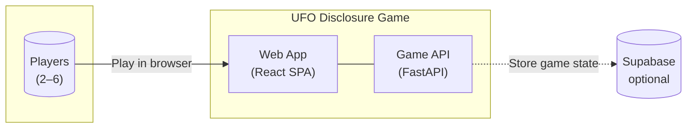
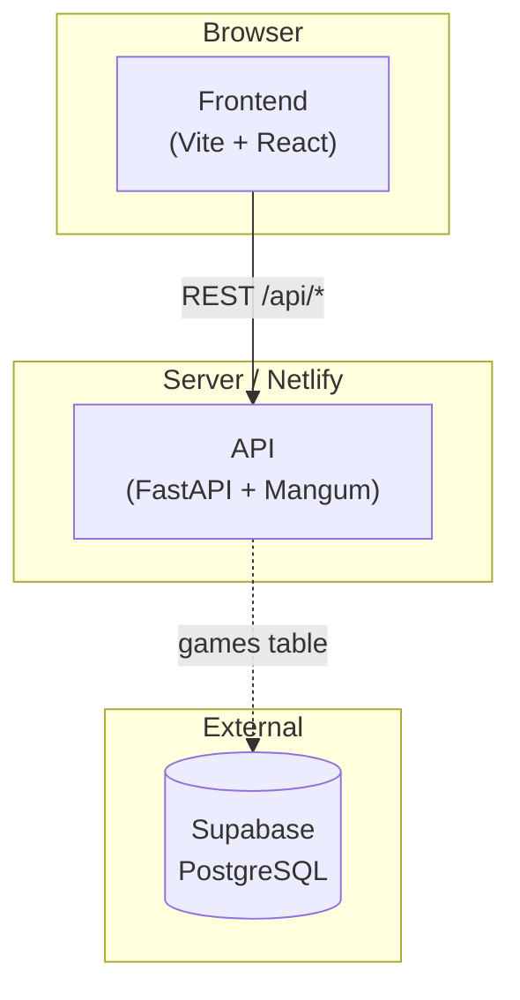
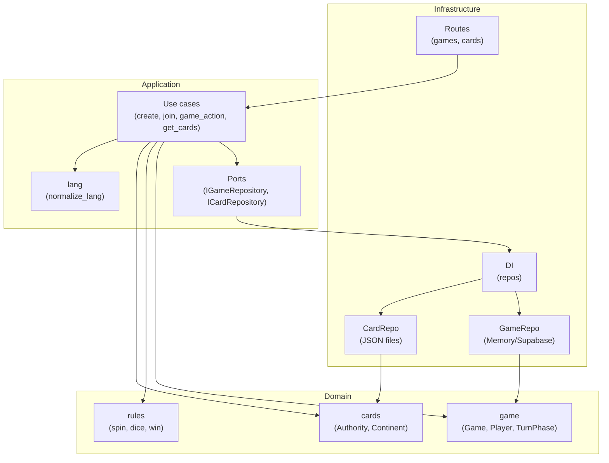
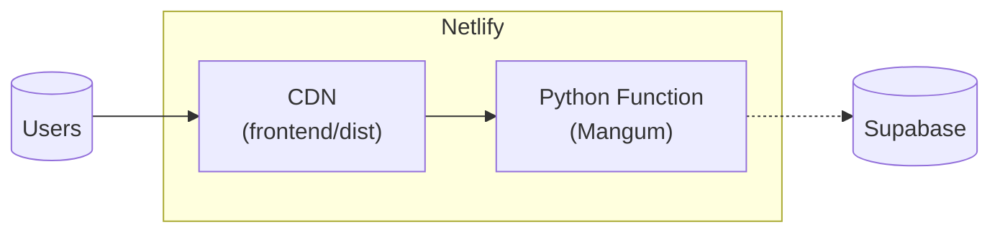
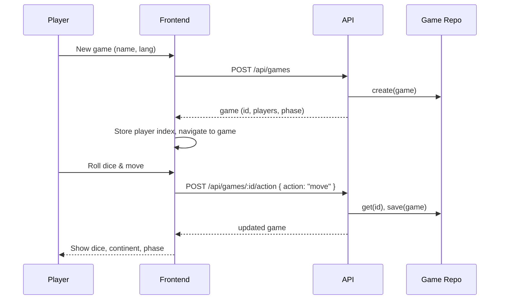

# UFO Disclosure Game — Architecture (C4 + Mermaid)

Simple C4-style documentation for the system. Diagrams are in [Mermaid](https://mermaid.js.org/); they render on GitHub, GitLab, and in any Mermaid-compatible viewer.

---

## C4 Level 1 — System Context

Who uses the system and what external systems it talks to.

| Element | Description |
|--------|--------------|
| **Players** | 2–6 people playing in a desktop browser (1920×1080). |
| **Web App** | React + TypeScript + Vite SPA: lobby, game screen, i18n (EN/FR). |
| **Game API** | Python FastAPI: create/join game, actions (move, spin, answer), card content. |
| **Supabase** | Optional: persists game state; without it, state is in-memory. |

---

## C4 Level 2 — Containers

High-level runnable building blocks.

| Container | Tech | Responsibility |
|-----------|------|-----------------|
| **Frontend** | Vite, React, TypeScript | Lobby (create/join), game UI, language, polling. Proxies `/api` to API in dev. |
| **API** | FastAPI, Mangum (Netlify) | REST: games, cards, actions. Clean Architecture: domain, application, infrastructure. |
| **Supabase** | PostgreSQL | Optional: `games(id, state, updated_at)`. Used when env vars are set. |

---

## C4 Level 3 — Components (inside the API)

Structure of the backend: domain, application, infrastructure.

Dependencies point **inward**: domain ← application ← infrastructure.

| Layer | Contents |
|-------|----------|
| **Domain** | `game.py` (Game, Player, DisclosurePath, TurnPhase), `rules.py` (spin_result, roll_dice, has_full_disclosure), `cards.py` (Authority, Continent, value object helpers). No I/O. |
| **Application** | Ports (interfaces): `IGameRepository`, `ICardRepository`. Use cases: create_game, join_game, perform_move, spin_spinner, submit_answer, get_pending_question, get_cards. `lang.normalize_lang` for i18n. |
| **Infrastructure** | Routes (FastAPI): `/api/games`, `/api/cards`, `/api/health`. DI: chooses GameRepo (memory vs Supabase) and CardRepo (JSON). Persistence: JSON under `api/data/`, optional Supabase table. |

---

## Deployment (Netlify)

- **Build:** `cd frontend && npm ci && npm run build` → publish `frontend/dist`.
- **Functions:** `api/` as Python runtime; `/api/*` routed to the function.
- **Redirects:** `netlify.toml` sends `/api/*` to the function and `/*` to the SPA.

---

## Data flow (simplified)

Create game and one action:

---

## Where to find what

| Concern | Path |
|---------|------|
| Game rules, entities | `api/src/domain/` |
| Use cases, ports | `api/src/application/` |
| HTTP, persistence, DI | `api/src/infrastructure/` |
| Card content (EN/FR) | `api/data/`, `api/data/fr/` |
| Lobby & game UI | `frontend/src/features/` |
| API client | `frontend/src/api/client.ts` |
