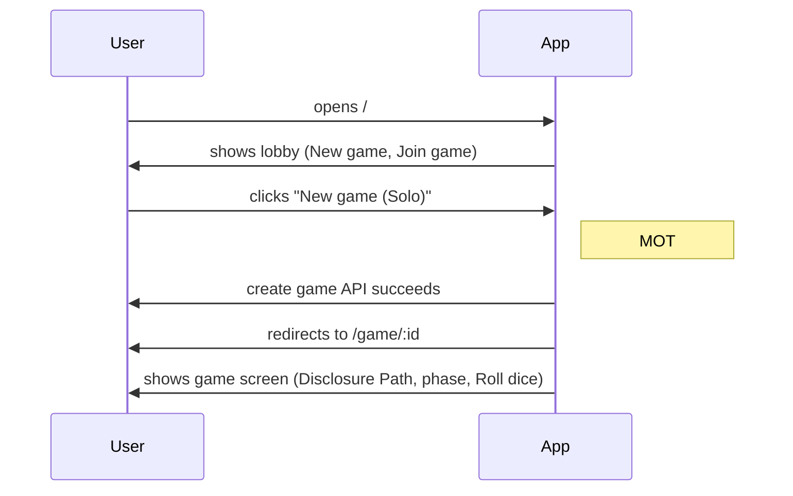
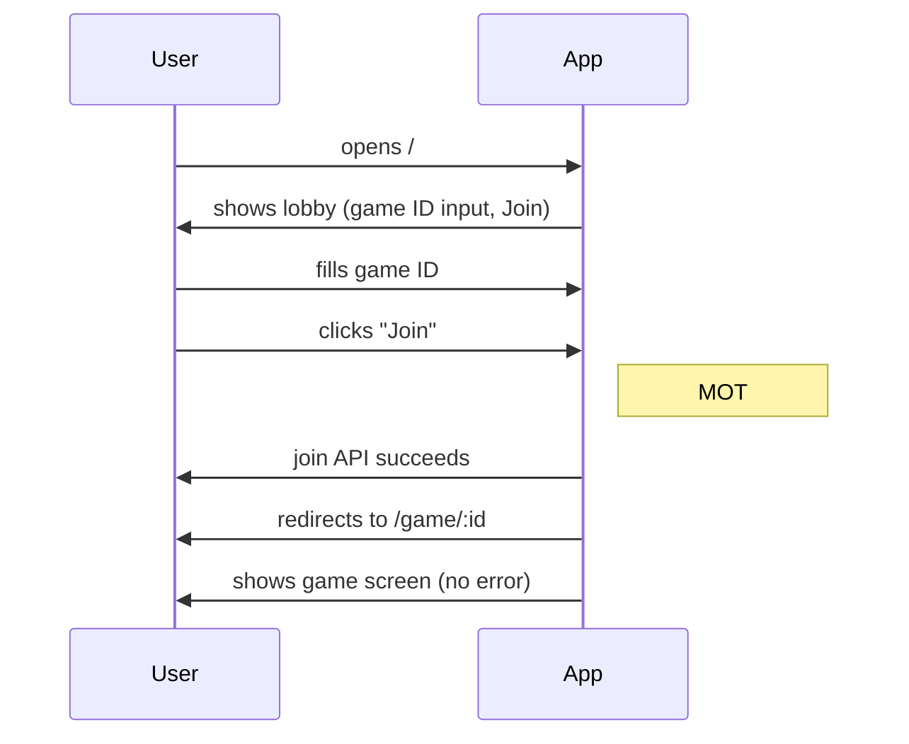
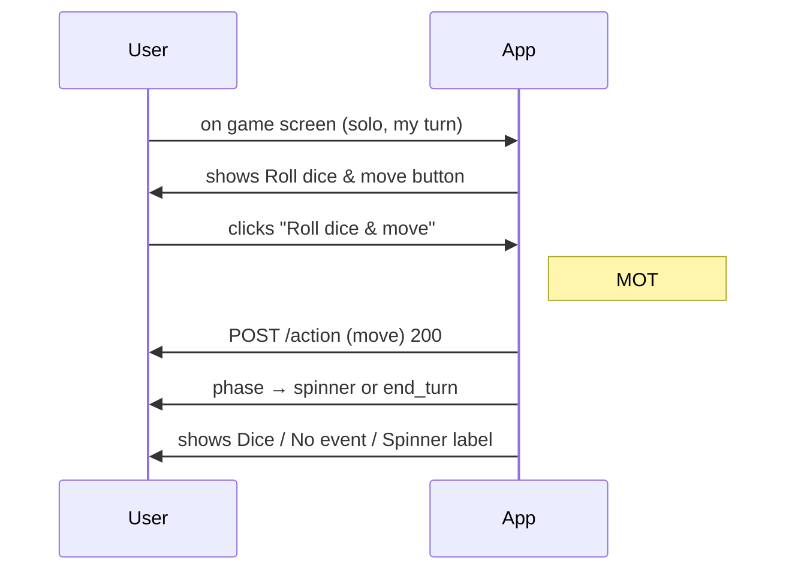

# Critical User Journeys (CUJs)

Identified from the UAP Disclosure Game codebase for e2e coverage. Limit 3–5; these are High-Traffic / core-action journeys. Each CUJ is covered by Playwright tests in `frontend/e2e/cuj-*.spec.ts`.

---

## CUJ 1: Create a new game (solo) and reach the game screen

| Component | Content |
|-----------|---------|
| **User** | First-time or returning player (solo). |
| **Goal** | When I want to play alone, I create a new game so I can see the game board and take my first turn. |
| **Tasks** | 1. Open lobby (/). 2. Optionally set player name. 3. Click "New game (Solo)". 4. **MOT:** Redirect to /game/:id. 5. See game screen: heading with game id, "Disclosure Path" section, phase. 6. Optional: "Roll dice & move" visible when it's my turn. |
| **MOTs** | Create game API succeeds; navigation to /game/:id; game screen content visible. |
| **Type** | High-Traffic |

### Sequence diagram

**Test file:** `frontend/e2e/cuj-create-game.spec.ts`

**Entry URL:** `/`  
**Success:** URL matches `/game/[a-z0-9-]+`, Disclosure Path and Phase visible.

---

## CUJ 2: Join an existing game

| Component | Content |
|-----------|---------|
| **User** | Second (or later) player with a game ID from the host. |
| **Goal** | When I have a game ID, I join the game so I can play with others. |
| **Tasks** | 1. Open lobby (/). 2. Enter game ID in the join field. 3. Click "Join". 4. **MOT:** Redirect to /game/:id. 5. See game screen; "Waiting for" or "Your turn" and two players in state. |
| **MOTs** | Join API succeeds; navigation to /game/:id; game screen shows joined state (no load failed). |
| **Type** | High-Traffic |

### Sequence diagram

**Test file:** `frontend/e2e/cuj-join-game.spec.ts`

**Entry URL:** `/`  
**Success:** URL matches `/game/:id`, game loaded (no "Load failed" / game-error visible). Test creates a game via UI first to get a valid game ID.

---

## CUJ 3: Complete one turn (roll dice and move)

| Component | Content |
|-----------|---------|
| **User** | Player in an existing game (their turn). |
| **Goal** | When it's my turn, I roll dice and move so I can advance on the board. |
| **Tasks** | 1. Be on game screen (game created via UI; sessionStorage set for player index). 2. Click "Roll dice & move". 3. **MOT:** Phase changes from lobby/movement to spinner or end_turn; dice value or "No event" or Spinner label visible. |
| **MOTs** | Move action API succeeds; phase and turn_state update in UI. |
| **Type** | OEC-Based (core gameplay) |

### Sequence diagram

**Test file:** `frontend/e2e/cuj-play-turn.spec.ts`

**Entry URL:** `/` then create game → `/game/:id`.  
**Success:** Phase is "spinner" or "end_turn"; Dice / No event card / Spinner visible; no game-error.

---

*Limit: 3–5 CUJs per product. Last updated: 2025-02-21.*
